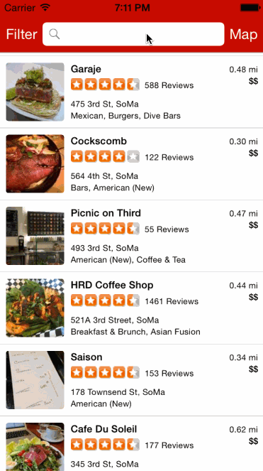

# Yelp

This is an iOS application to show Yelp restaurants.

Time spent: 4 hours spent in total

Completed user stories:
## Search results page
* [x] Required: Table rows should be dynamic height according to the content height
* [x] Required: Custom cells should have the proper Auto Layout constraints
* [x] Required: Search bar should be in the navigation bar (doesn't have to expand to show location like the real Yelp app does).
  Hint: This is just a UISearchBar that is set as the navigationItem.titleView
* [x] Optional: infinite scroll for restaurant results
* [x] Optional: Implement map view of restaurant results
##Filter page. Unfortunately, not all the filters are supported in the Yelp API.
* [x] Required: The filters you should actually have are: category, sort (best match, distance, highest rated), radius (meters), deals (on/off).
* [x] Required: The filters table should be organized into sections as in the mock.
* [x] Required: You can use the default UISwitch for on/off states.
* [ ] Optional: implement a custom switch
* [x] Required: Clicking on the "Search" button should dismiss the filters page and trigger the search w/ the new filter settings.
* [ ] Optional: Radius filter should expand as in the real Yelp app
* [ ] Optional: Categories should show a subset of the full list with a "See All" row to expand. Category list is here: http://www.yelp.com/developers/documentation/category_list (Links to an external site.)
* [ ] Optional: Implement the restaurant detail page.

Walkthrough of all user stories:

GIF created with [LiceCap](http://www.cockos.com/licecap/).
MyLocation class taken from [Ray Wenderlich](http://www.raywenderlich.com/21365/introduction-to-mapkit-in-ios-6-tutorial).
